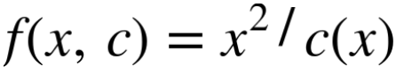
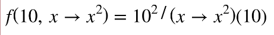

# Becoming Functional Notes

## Chapter 2. First Class Functions

### Anonymous functions

- Anonymous functions are split up into two types, lambda functions and closures.

### Lambda functions

- Lambda functions are *unnamed* functions that contain a *parameter list*, a *body* and a return.

